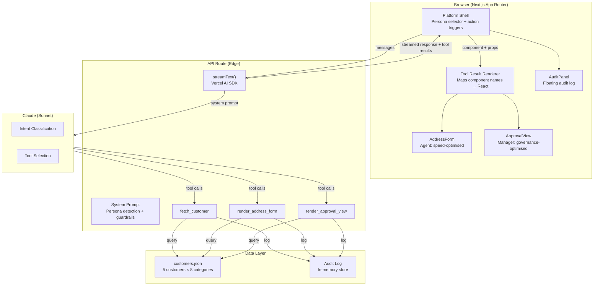
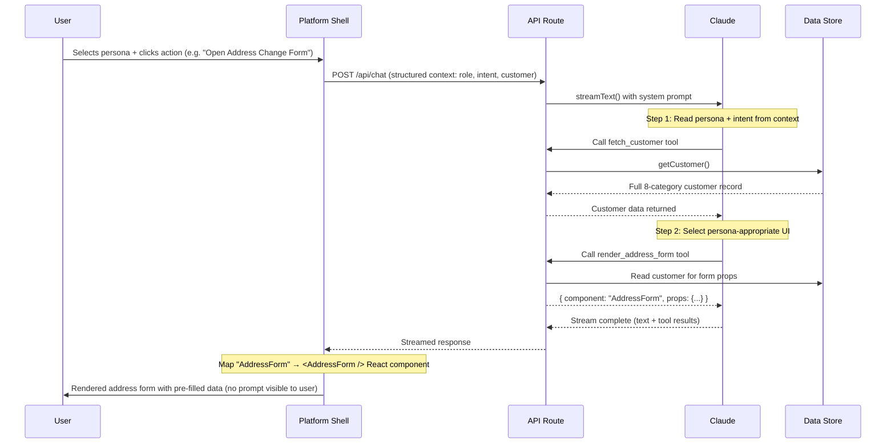

# Canvas — Generative UI for Customer Servicing

A proof of concept demonstrating how large language models can **dynamically generate the right UI for the right user at the right time** — replacing static page routing with context-aware, persona-adaptive interfaces.

Built with Next.js, the Vercel AI SDK, and Claude.

---

## The Problem

Traditional customer servicing platforms suffer from a rigid, one-size-fits-all approach:

**For front-line agents on live calls**, every second counts. But they navigate the same multi-step wizards as back-office staff — clicking through tabs, loading compliance screens they don't need, and manually cross-referencing customer data across separate systems. The result: longer call times, higher error rates, and frustrated customers on hold.

**For case managers reviewing changes**, the opposite problem exists. They need governance context — compliance flags, audit trails, before/after diffs — but the same generic interface buries this information behind the same simplified forms designed for speed. They end up toggling between multiple screens to make an informed decision.

The core issue is that **traditional UIs are built around pages and workflows, not around people and tasks**. Every user sees the same screens regardless of their role, their intent, or the risk profile of the customer they're serving.

## The Canvas Approach

Canvas flips this model. Instead of routing users to pre-built pages, it reads **who you are** and **what you're trying to do** from platform context, then assembles the right interface on the fly — no prompt required.

```
Sarah logs in as Call Centre Agent → customer record CUST-123 is open → she clicks "Open Address Change Form"

→ Canvas reads: Agent identity + address change intent + open customer context
→ Fetches customer data (KYC: verified, risk: low, joint account)
→ Renders: streamlined address form with PAF lookup, pre-filled fields,
  and a collapsible compliance panel — optimised for speed
```

```
James logs in as Case Manager → pending task appears in his queue → he clicks "Review Pending Change"

→ Canvas reads: Manager identity + approval intent + pending task context
→ Fetches customer data + pending change details
→ Renders: governance card with before/after diff, compliance tabs,
  Experian scoring, and approve/amend/reject controls
```

Same data. Same API. Completely different experiences — each optimised for the user's actual job. The LLM is invisible infrastructure; it never surfaces as a chatbot.

---

## Architecture

### System Overview



### Request Flow



### The 4 Agentic Pillars

```mermaid
graph LR
    subgraph Memory["1. Memory"]
        M1["Customer data model"]
        M2["8 categories per customer"]
        M3["5 diverse seed records"]
    end

    subgraph Knowledge["2. Knowledge"]
        K1["System prompt"]
        K2["Persona detection rules"]
        K3["Intent classification"]
    end

    subgraph Tools["3. Tools"]
        T1["fetch_customer"]
        T2["render_address_form"]
        T3["render_approval_view"]
    end

    subgraph Guardrails["4. Guardrails"]
        G1["Maker-checker enforcement"]
        G2["Agents cannot approve"]
        G3["Managers cannot edit"]
        G4["Experian score threshold"]
        G5["Address field validation"]
        G6["Rate limiting"]
    end

    Memory --> Knowledge
    Knowledge --> Tools
    Tools --> Guardrails
```



---

## Guardrails

Canvas enforces a **defence-in-depth** guardrail model — controls are applied at the LLM prompt layer, the server-side tool execute layer, and the API submission layer independently. A bypass at one layer does not compromise the others.

| ID | Guardrail | Trigger | Enforcement Layer |
|----|-----------|---------|-------------------|
| G-01 | Agent cannot approve | Agent calls the approval tool | System prompt + `execute()` check |
| G-02 | Manager cannot edit addresses | Manager calls the address form tool | System prompt + `execute()` check |
| G-03 | Customer fetch before render | Render tool called without prior fetch | System prompt instruction |
| G-04 | Experian score threshold | Approval submitted with score < 5/9 | Submit endpoint (HTTP 422) |
| G-05 | Address field validation | Invalid postcode or empty required fields | Submit endpoint (HTTP 422) |
| G-06 | Rate limiting | >20 requests/min per IP | API route (HTTP 429) |

Every guardrail event is logged in the audit trail with `guardrailTriggered: true` and visible in the floating Audit Log panel.

See [GUARDRAILS.md](./GUARDRAILS.md) for the full reference — including enforcement implementation, test prompts, and production hardening recommendations.

---

## Personas

### Sarah — Call Centre Agent

Sarah is on a live call. She needs to update a customer's address with minimal friction.

Canvas renders her a **streamlined address form** with PAF (Postcode Address File) lookup, Experian identity scoring, real-time validation, and a collapsible panel showing relevant customer context (KYC status, risk rating, linked products) — everything she needs without leaving the form.

**Guardrail:** Sarah cannot access approval controls. If she asks to approve a change, Canvas explains the maker-checker policy.

### James — Case Manager

James works through a queue of assigned servicing tasks. He needs to review proposed changes against the customer's full profile before making a governance decision.

Canvas renders him a **tabbed approval card** with three views: Change Details (before/after diff with Experian score), Compliance (KYC, AML, sanctions, PEP, and fraud flags), and Customer Profile (financial summary, linked products table, behavioural data). He can approve, amend, or reject — with full context.

**Guardrail:** James cannot directly edit addresses. If he asks to make a change, Canvas explains that edits are initiated by front-line agents.

---

## Customer Data Model

Each customer record spans 8 categories, reflecting the depth of data available in real banking systems:

| Category | Key Fields | Example |
|----------|-----------|---------|
| **Core Identity** | Full name, preferred name, DOB, KYC status | KYC: Verified (2024-11-15) |
| **Contact** | Current address, phone, email, preferred channel | Channel: Mobile App |
| **Relationship** | Account type, joint holders, relationship manager | Joint account with Robert Miller |
| **Compliance** | Risk rating, AML screening, sanctions, PEP status | Risk: Low, AML: Clear |
| **Financial Profile** | Credit score, income, occupation, source of funds | Experian: 742 |
| **Product Linkages** | Accounts, mortgages, cards with balances and status | 3 active products |
| **Behavioural Data** | Segment, tenure, primary channel, transaction volume | Premier since 2015 |
| **Security** | Auth method, last security review, login attempts | Biometric + PIN |

The POC ships with 5 seed customers covering a range of risk profiles, compliance states, and product portfolios:

| ID | Name | Tier | Risk | Compliance State | Pending Change |
|----|------|------|------|------------------|----------------|
| CUST-123 | Sarah Miller | Premier | Low | Verified | Yes (call centre) |
| CUST-456 | Ahmed Hassan | Business | Medium | Verified | Yes (eBanking) |
| CUST-789 | Yuki Tanaka | Premier | High | PEP Flagged | No |
| CUST-012 | James Wilson | Standard | Low | KYC Expired | No |
| CUST-345 | Lisa Rodriguez | Standard | High | Fraud Under Review | No |

---

## Tech Stack

| Layer | Technology | Role |
|-------|-----------|------|
| Framework | Next.js 14 (App Router) | Server-side rendering, API routes, file-based routing |
| AI Integration | Vercel AI SDK v4 | `streamText()`, tool calling, `maxSteps` for multi-step chains |
| LLM | Claude Sonnet (@ai-sdk/anthropic) | Persona detection, intent classification, tool selection |
| UI Components | Shadcn/UI (12 primitives) | Button, Card, Input, Badge, Tabs, Dialog, Table, Tooltip, Avatar, etc. |
| Styling | Tailwind CSS + custom brand theme | CSS variables for palette, Urbanist font, pill buttons |
| Validation | Zod | Tool parameter schemas |
| Language | TypeScript (strict mode) | End-to-end type safety |

---

## Project Structure

```
canvas-poc/
├── src/
│   ├── app/
│   │   ├── page.tsx                    # Platform shell: persona selector, context panel, action triggers, canvas
│   │   ├── layout.tsx                  # Root layout with metadata
│   │   ├── globals.css                 # Brand theme (CSS variables, Urbanist font)
│   │   ├── design-system/
│   │   │   └── page.tsx                # Component library showcase (12 sections)
│   │   └── api/
│   │       ├── chat/
│   │       │   ├── route.ts            # Claude integration, system prompt, 3 tools
│   │       │   └── submit/
│   │       │       └── route.ts        # Address submission endpoint
│   │       └── audit/
│   │           └── route.ts            # Audit trail API
│   ├── components/
│   │   ├── address-form.tsx            # Agent form: PAF lookup, Experian, profile panel
│   │   ├── approval-view.tsx           # Manager card: tabbed governance view
│   │   ├── audit-panel.tsx             # Floating audit log overlay
│   │   └── ui/                         # Shadcn primitives
│   │       ├── button.tsx
│   │       ├── card.tsx
│   │       ├── input.tsx
│   │       ├── label.tsx
│   │       ├── badge.tsx
│   │       ├── separator.tsx
│   │       ├── scroll-area.tsx
│   │       ├── tabs.tsx
│   │       ├── dialog.tsx
│   │       ├── table.tsx
│   │       ├── tooltip.tsx
│   │       └── avatar.tsx
│   ├── data/
│   │   └── customers.json              # 5 customer records (8-category schema)
│   └── lib/
│       ├── mock-data.ts                # Data access: getCustomer(), getAllCustomers()
│       ├── audit.ts                    # Audit logging utilities
│       └── utils.ts                    # cn() class merge utility
├── public/
├── GUARDRAILS.md                       # Guardrail inventory, enforcement details, test prompts
├── DEMO-SCRIPT.md                      # Stakeholder walkthrough guide
├── package.json
├── tailwind.config.ts
├── tsconfig.json
└── next.config.ts
```

---

## Getting Started

### Prerequisites

Node.js 18+ and an Anthropic API key.

### Setup

```bash
# Clone the repository
git clone https://github.com/RajiBhamidipati/canvas-poc.git
cd canvas-poc

# Install dependencies
npm install

# Set your API key
echo "ANTHROPIC_API_KEY=sk-ant-..." > .env.local

# Start the dev server
npm run dev
```

### Usage

Open [http://localhost:3000](http://localhost:3000) for the platform shell.

The left panel simulates the platform context Canvas would receive in production (identity from SSO, open customer record, active task):

1. **Select a persona** — Sarah (Call Centre Agent) or James (Case Manager)
2. **Trigger an action** — click the role-appropriate button in the panel
3. **Canvas renders** the right component on the right — no prompt, no chat

**As Sarah:** optionally enter the customer's new address before clicking "Open Address Change Form" to pre-fill the form.

**Guardrail test:** while signed in as Sarah, click "Try: Approve as Agent" to see the maker-checker policy enforced.

Visit [http://localhost:3000/design-system](http://localhost:3000/design-system) for the component library showcase.

---

## Design System

The `/design-system` route provides a visual component library with 12 sections: Brand, Typography, Colours, Buttons, Cards, Forms, Badges, Tables, Tabs, Dialogs, Tooltips, and Avatars. All components use the custom brand theme defined in `globals.css` with the Urbanist typeface and a lime/blue/purple accent palette.


## Roadmap

Future iterations could explore: multi-customer selection (agent picks from a search), real PAF/Experian API integration, WebSocket-based live updates between agent and manager views, persistent database with Prisma ORM, role-based authentication, and additional servicing journeys beyond address changes.

---

## Licence

Internal POC
